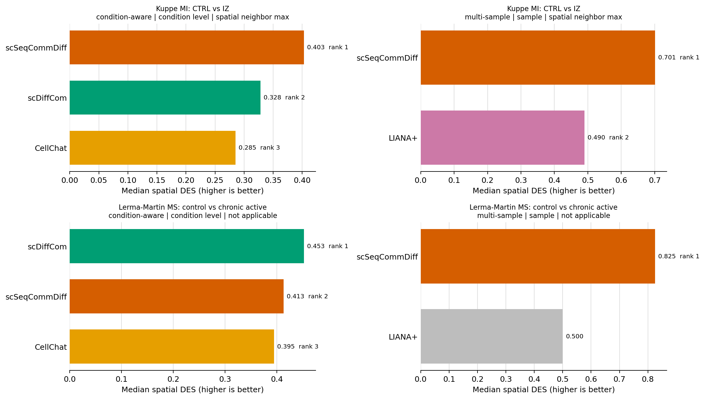
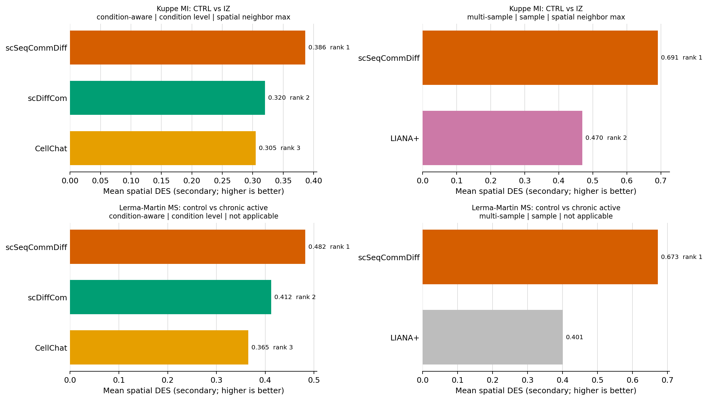
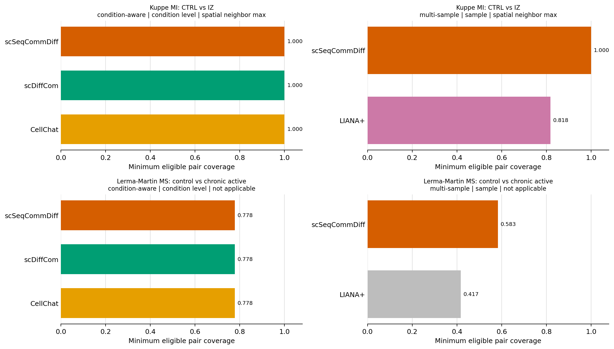

# Spatial differential CCC benchmark

Results are ranked only within checksum-compatible comparison panels. Panels never mix datasets, spatial truth variants, analysis units, self-pair policies, tie policies, or DES semantics. A method is ranked only when all eight condition-by-top-fraction strata are observed. The primary report excludes the LIANA 1.7.3 descriptive sensitivity arm. MultiNicheNet is a declared skip because no validated frozen adapter was available; see the benchmark protocol for the full scope and deviations.

## Leaderboard

| Dataset | Scenario | Unit | Truth variant | Panel | Method | Median rank | Mean rank | Median DES | Mean DES | Min rank coverage | Min truth coverage |
|---|---|---|---|---|---|---|---|---|---|---|---|
| Kuppe_MI_spatial_CTRL_vs_IZ | condition_aware | condition_level | spatial_neighbor_max | spatial_des_panel_c058253ce02f8463d22bd97b | scSeqCommDiff | 1 | 1 | 0.403 | 0.386 | 1.000 | 1.000 |
| Kuppe_MI_spatial_CTRL_vs_IZ | condition_aware | condition_level | spatial_neighbor_max | spatial_des_panel_c058253ce02f8463d22bd97b | scDiffCom | 2 | 2 | 0.328 | 0.320 | 1.000 | 1.000 |
| Kuppe_MI_spatial_CTRL_vs_IZ | condition_aware | condition_level | spatial_neighbor_max | spatial_des_panel_c058253ce02f8463d22bd97b | CellChat | 3 | 3 | 0.285 | 0.305 | 1.000 | 1.000 |
| Kuppe_MI_spatial_CTRL_vs_IZ | multi_sample | sample_id | spatial_neighbor_max | spatial_des_panel_154c4a039aacaa00a03be65e | scSeqCommDiff | 1 | 1 | 0.701 | 0.691 | 1.000 | 1.000 |
| Kuppe_MI_spatial_CTRL_vs_IZ | multi_sample | sample_id | spatial_neighbor_max | spatial_des_panel_154c4a039aacaa00a03be65e | LIANA+ | 2 | 2 | 0.490 | 0.470 | 0.818 | 0.909 |
| lerma_martin_ms_ctrl_vs_chronic_active | condition_aware | condition_level | not_applicable | spatial_des_panel_53e00c3d3f0dca31149471c7 | scDiffCom | 1 | 2 | 0.453 | 0.412 | 0.778 | 0.625 |
| lerma_martin_ms_ctrl_vs_chronic_active | condition_aware | condition_level | not_applicable | spatial_des_panel_53e00c3d3f0dca31149471c7 | scSeqCommDiff | 2 | 1 | 0.413 | 0.482 | 0.778 | 0.625 |
| lerma_martin_ms_ctrl_vs_chronic_active | condition_aware | condition_level | not_applicable | spatial_des_panel_53e00c3d3f0dca31149471c7 | CellChat | 3 | 3 | 0.395 | 0.365 | 0.778 | 0.625 |
| lerma_martin_ms_ctrl_vs_chronic_active | multi_sample | sample_id | not_applicable | spatial_des_panel_cb397b89bbd478bb47ce4649 | scSeqCommDiff | 1 | 1 | 0.825 | 0.673 | 0.583 | 0.333 |
| lerma_martin_ms_ctrl_vs_chronic_active | multi_sample | sample_id | not_applicable | spatial_des_panel_cb397b89bbd478bb47ce4649 | LIANA+ | not ranked | not ranked | 0.500 | 0.401 | 0.417 | 0.000 |

## Figures

