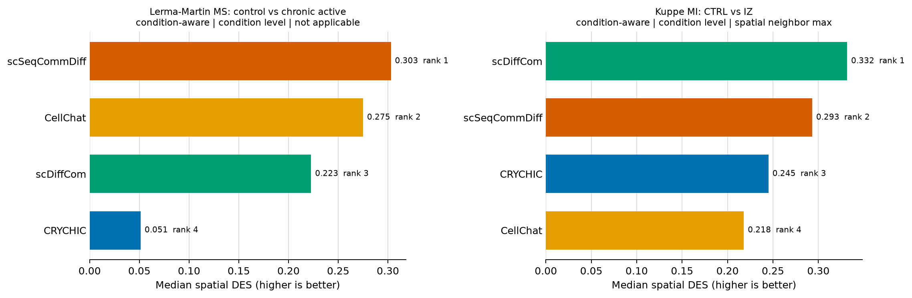
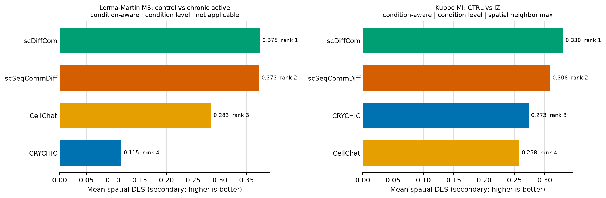
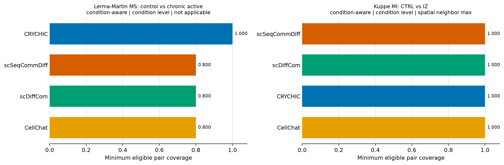

# Spatial differential CCC benchmark

Results are ranked only within checksum-compatible comparison panels. Panels never mix datasets, spatial truth variants, analysis units, or DES semantics. A method is ranked only when all eight condition-by-top-fraction strata are observed. The primary report excludes the LIANA 1.7.3 descriptive sensitivity arm. MultiNicheNet is a declared skip because no validated frozen adapter was available; see the adjacent protocol document for the full scope and deviations.

## Leaderboard

| Dataset | Scenario | Unit | Truth variant | Panel | Method | Median rank | Mean rank | Median DES | Mean DES | Min rank coverage | Min truth coverage |
|---|---|---|---|---|---|---|---|---|---|---|---|
| Kuppe_MI_spatial_CTRL_vs_IZ | condition_aware | condition_level | spatial_neighbor_max | spatial_des_panel_c28439754fc5792f2330c5f7 | scDiffCom | 1 | 1 | 0.332 | 0.330 | 1.000 | 1.000 |
| Kuppe_MI_spatial_CTRL_vs_IZ | condition_aware | condition_level | spatial_neighbor_max | spatial_des_panel_c28439754fc5792f2330c5f7 | scSeqCommDiff | 2 | 2 | 0.293 | 0.308 | 1.000 | 1.000 |
| Kuppe_MI_spatial_CTRL_vs_IZ | condition_aware | condition_level | spatial_neighbor_max | spatial_des_panel_c28439754fc5792f2330c5f7 | CRYCHIC | 3 | 3 | 0.245 | 0.273 | 1.000 | 1.000 |
| Kuppe_MI_spatial_CTRL_vs_IZ | condition_aware | condition_level | spatial_neighbor_max | spatial_des_panel_c28439754fc5792f2330c5f7 | CellChat | 4 | 4 | 0.218 | 0.258 | 1.000 | 1.000 |
| lerma_martin_ms_ctrl_vs_chronic_active | condition_aware | condition_level | not_applicable | spatial_des_panel_767d03dcc79e3a75e9977c81 | scSeqCommDiff | 1 | 2 | 0.303 | 0.373 | 0.800 | 0.500 |
| lerma_martin_ms_ctrl_vs_chronic_active | condition_aware | condition_level | not_applicable | spatial_des_panel_767d03dcc79e3a75e9977c81 | CellChat | 2 | 3 | 0.275 | 0.283 | 0.800 | 0.500 |
| lerma_martin_ms_ctrl_vs_chronic_active | condition_aware | condition_level | not_applicable | spatial_des_panel_767d03dcc79e3a75e9977c81 | scDiffCom | 3 | 1 | 0.223 | 0.375 | 0.800 | 0.500 |
| lerma_martin_ms_ctrl_vs_chronic_active | condition_aware | condition_level | not_applicable | spatial_des_panel_767d03dcc79e3a75e9977c81 | CRYCHIC | 4 | 4 | 0.051 | 0.115 | 1.000 | 1.000 |

## Figures

